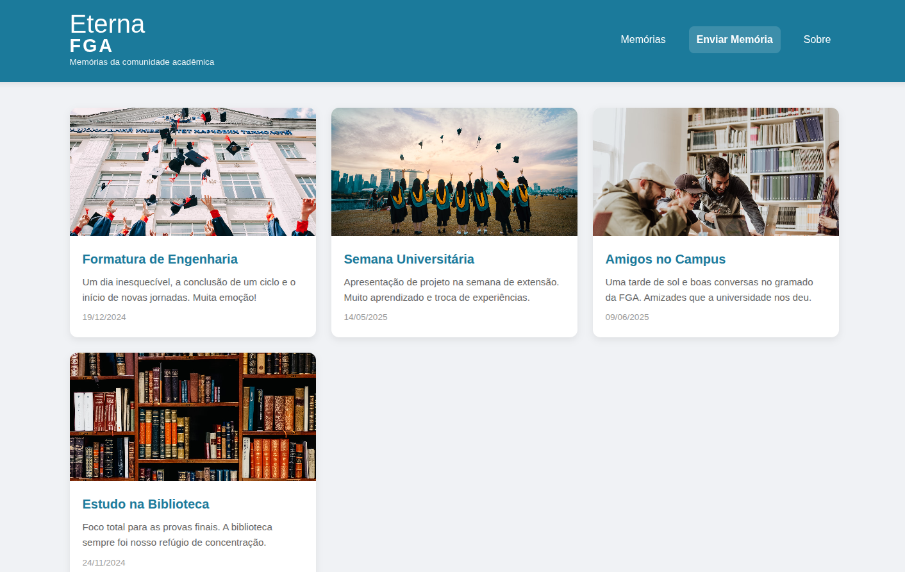

# Eterna FGA

**Código da Disciplina**: FGA0208 
**Número do Grupo**: 02 
**Entrega**: 04 

## Alunos

| Matrícula | Aluno                                   | Github |
| :-: | :-: | :-: |
| 221008356 | Maria Eduarda Vieira Monteiro           | [DudaV228](https://github.com/DudaV228) |
| 222021890 | Manuella Magalhães Valadares            | [manuvaladares](https://github.com/manuvaladares)|
| 222021906 | Marcos Vieira Marinho                   | [devMarcosVM](https://github.com/devMarcosVM)|
| 222026386 | Pedro Gois Marques Monteiro             | [Goizzz](https://github.com/Goizzz)|

## Sobre

A Eterna FGA é um museu afetivo virtual, uma aplicação web criada para eternizar as memórias da comunidade acadêmica. Nele, qualquer pessoa da comunidade pode enviar suas imagens, compartilhar suas histórias e conhecer um pouco mais sobre as pessoas que fazem parte do cotidiano da faculdade.

## Screenshots da Quarta Entrega

## Há algo a ser executado?

(X) SIM

( ) NÃO

[Como rodar](/ArquiteturaReutilizacao/4.2.5.Aplicacao.md)

## Histórico de Versão

| Versão | Data | Descrição | Autor(es) | Revisor(es) | Comentário do Revisor |
| :-: | :-: | :-: | :-: | :-: | :-: |
| `1.0` | 25/06/2025  | Versão inicial do README. | Manuella | Marcos | Adiconando Screenshots e arrumando o link para como rodar|